# 🔒 GitHub Threat Intelligence for Cyber Risk Analysts
[](https://github.com/features/security)
[]() <br>
Transform GitHub into your organization's early-warning threat intelligence system

---

## 1. Why GitHub is a Cyber Risk Analyst's Secret Weapon  
### 🌐 Threat Landscape


- **Code = Risk Surface**:  
  Every repository is a potential attack vector:  
  ```mermaid
  graph LR
    A[Public Repo] --> B[Hardcoded Secrets]
    A --> C[Vulnerable Dependencies]
    A --> D[Misconfigurations]
    B --> E[Cloud Account Takeover]
    C --> F[Supply Chain Attacks]
    D --> G[Data Leaks]
  ```

- **Four Strategic Advantages**:  
  1. **Threat Hunting**: Find exposed credentials before attackers do  
  2. **Supply Chain Defense**: Map dependencies to known CVEs  
  3. **Compliance Auditing**: Prove secure development practices  
  4. **Workflow Automation**: Embed security into CI/CD pipelines  

---

#### 2. Core GitHub Concepts Demystified  
**The Analyst's Cheat Sheet**:  

| **Term**         | **What It Is**                          | **Risk Relevance**                                  |  
|-------------------|-----------------------------------------|-----------------------------------------------------|  
| **Repository**    | Project folder (code + config files)    | Primary scan target for secrets/vulnerabilities     |  
| **Branch**        | Isolated workspace for changes          | Test security fixes safely                          |  
| **Commit**        | Saved code change with timestamp        | Audit trail for suspicious modifications            |  
| **Pull Request**  | Request to merge code changes           | Security review checkpoint before deployment        |  
| **Issues**        | Task/bug tracking system                | Document & triage security flaws                    |  
| **Actions**       | CI/CD automation workflows              | Run automated security scans on every code change   |  

---

#### **3. Hands-On Security Tasks (Step-by-Step)**  

##### **Task 1: Hunt Exposed Secrets**  
*Find accidentally committed credentials in 5 minutes*  

**Tools Comparison**:  
| Tool             | Method               | Best For                          |  
|------------------|----------------------|-----------------------------------|  
| GitHub Search    | Native syntax        | Quick ad-hoc investigations       |  
| TruffleHog       | Entropy analysis     | Deep historical scans             |  
| GitGuardian      | Cloud-native         | Enterprise-scale monitoring       |  

**Step-by-Step**:  
1. **Basic GitHub Search**:  
   ```search
   org:acme-corp filename:.env AWS_SECRET_ACCESS_KEY
   ```
   *Filters: `path:`, `filename:`, `extension:`, `org:`*  

2. **Deep Scan with TruffleHog**:  
   ```bash
   # Install and run
   docker run --rm -v "$PWD:/scan" trufflesecurity/trufflehog:latest git https://github.com/acme-corp/repo --only-verified
   ```
     

3. **Automate Detection** (GitHub Actions):  
   ```yaml
   # .github/workflows/secret-scan.yml
   name: Secret Scanner
   on: [push, pull_request]
   jobs:
     trufflehog:
       runs-on: ubuntu-latest
       steps:
         - uses: actions/checkout@v4
         - name: Scan for secrets
           uses: trufflesecurity/trufflehog@main
           with:
             args: --regex --entropy=False
   ```

---
## 🔎 Live Secret Scan Demo
[](https://github.com/codespaces/new?machine=basicLinux32gb&repo=your-repo&devcontainer_path=.devcontainer%2Fdevcontainer.json)

### One-click scanning environment
curl -sL https://raw.githubusercontent.com/trufflesecurity/trufflehog/main/docker-compose.yml | docker-compose -f - up <br>
<br>
Experience live secret scanning without local setup. Click the badge above to launch a pre-configured GitHub Codespace.
##### **Task 2: Audit Dependencies**  
*Find vulnerable libraries before they're exploited*  

**Dependency Risk Matrix**:  
| Risk Level | Example                  | Impact               |  
|------------|--------------------------|----------------------|  
| **Critical** | Log4Shell (CVE-2021-44228) | RCE, data theft      |  
| **High**     | Spring4Shell (CVE-2022-22965) | Server compromise    |  
| **Medium**   | jQuery XSS (CVE-2020-11022) | Client-side attacks  |  

### Critical CVE Timeline


**Visual Guide**:  


**Execution**:  
1. Enable **Dependabot**:  
   `Repo Settings > Security & Analysis > Enable Dependabot alerts`  
     

2. Manual CLI Scan:  
   ```bash
   # Install OWASP Dependency-Check
   docker pull owasp/dependency-check

   # Run scan
   docker run --rm \
     -v $(pwd):/src \
     owasp/dependency-check:latest \
     --scan /src \
     --format HTML
   ```

---

##### **Task 3: Enforce Security Policies**  
*Make security mandatory in development workflows*  

**Policy Template**:  
```markdown
# SECURITY.md
## Reporting Vulnerabilities
Email security@acme-corp.com within 24 hours of discovery

## Requirements
- [ ] No secrets in code
- [ ] Dependencies scanned weekly
- [ ] Critical CVEs patched in 72h
```

**Branch Protection Rules**:  
`Repo Settings > Branches > Add Rule`  
- [x] Require pull request reviews  
- [x] Require status checks (SAST/secret scans)  
- [x] Require signed commits  

---

#### **4. Pro Security Framework**  
**GitHub Security Stack**:  


**Enterprise-Grade Controls**:  
- **Access Governance**:  
  ```mermaid
  graph LR
    SAML_SSO-->RBAC
    RBAC-->Team_Permissions
    Team_Permissions-->Repo_Access
  ```
- **Audit Trail**: `Organization Settings > Audit Log`  
- **Compliance Reports**: Generate SOC2/ISO27001 evidence  

---

#### **5. Real-World Attack Chain**  
*How attackers exploit GitHub misconfigurations*  

```mermaid
sequenceDiagram
    Attacker->>GitHub: Search for “extension:json password”
    GitHub-->>Attacker: 1,200 results
    Attacker->>AWS: Test stolen keys
    AWS-->>Attacker: S3 bucket access granted
    Attacker->>Production DB: Exfiltrate 14M records
```



**Mitigation Playbook**:  
1. **Detect**: GitHub Advanced Security alerts  
2. **Contain**: Automatically revoke keys via AWS Lambda  
3. **Remediate**: Force credential rotation + developer training  
4. **Prevent**: Block commits with secrets using pre-commit hooks  

---

#### **6. 30-Day Mastery Roadmap**  
| Week | Focus Area             | Key Tasks                                                                 |  
|------|------------------------|---------------------------------------------------------------------------|  
| 1    | Reconnaissance         | - Master GitHub search syntax<br>- Find 5 exposed API keys                |  
| 2    | Dependency Security    | - Enable Dependabot<br>- Audit one project's dependencies                 |  
| 3    | Automation             | - Build SAST pipeline with Bandit/Semgrep<br>- Scan on every PR           |  
| 4    | Policy Enforcement     | - Implement SECURITY.md<br>- Configure branch protection rules            |  

---

#### **7. Essential Tools & Resources**  
**Free Tool Stack**:  


**Learning Path**:  
1. [GitHub Security Lab Courses](https://securitylab.github.com/education)  
2. [OWASP Secure Coding Practices](https://owasp.org/www-project-secure-coding-practices-quick-reference-guide/)  
3. [CodeQL Crash Course](https://codeql.github.com/docs/codeql-overview/)  

> **Analyst Pro Tip**: Start with `org:yourcompany is:public` searches - 62% of credential leaks come from personal repos (GitGuardian 2024).
graph LR
    GitHub-->Dependabot
    GitHub-->CodeQL
    GitHub-->SecretScanning
    GitHub-->Actions
    Actions-->SAST
    Actions-->DAST
    SecretScanning-->Blocking
    Dependabot-->AutoPRs
  
*Figure 2: Integrated risk management through GitHub's security ecosystem*

---
**Final Takeaway**: For cyber risk analysts, GitHub isn't just a code platform,it's a live threat intelligence feed. By mastering search, automation, and policy enforcement, you turn code repositories into your first line of defense. 🔍🔒
